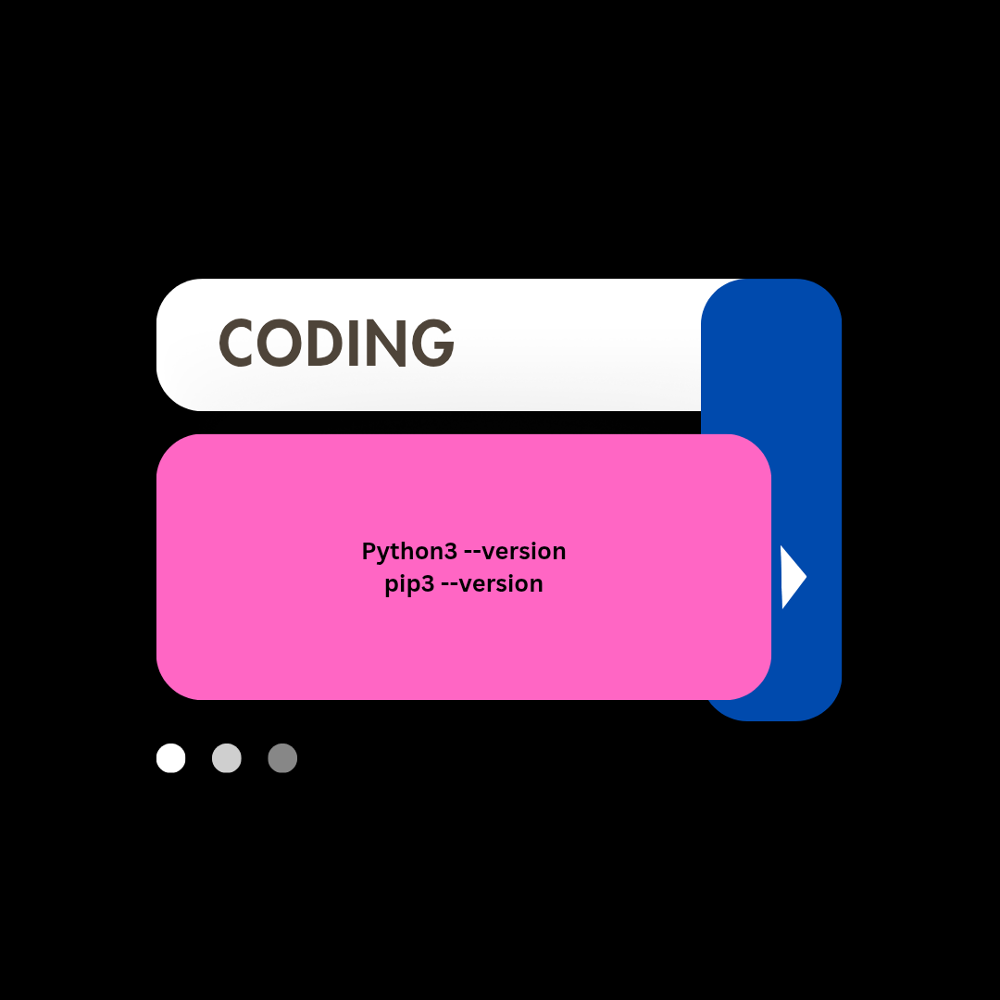
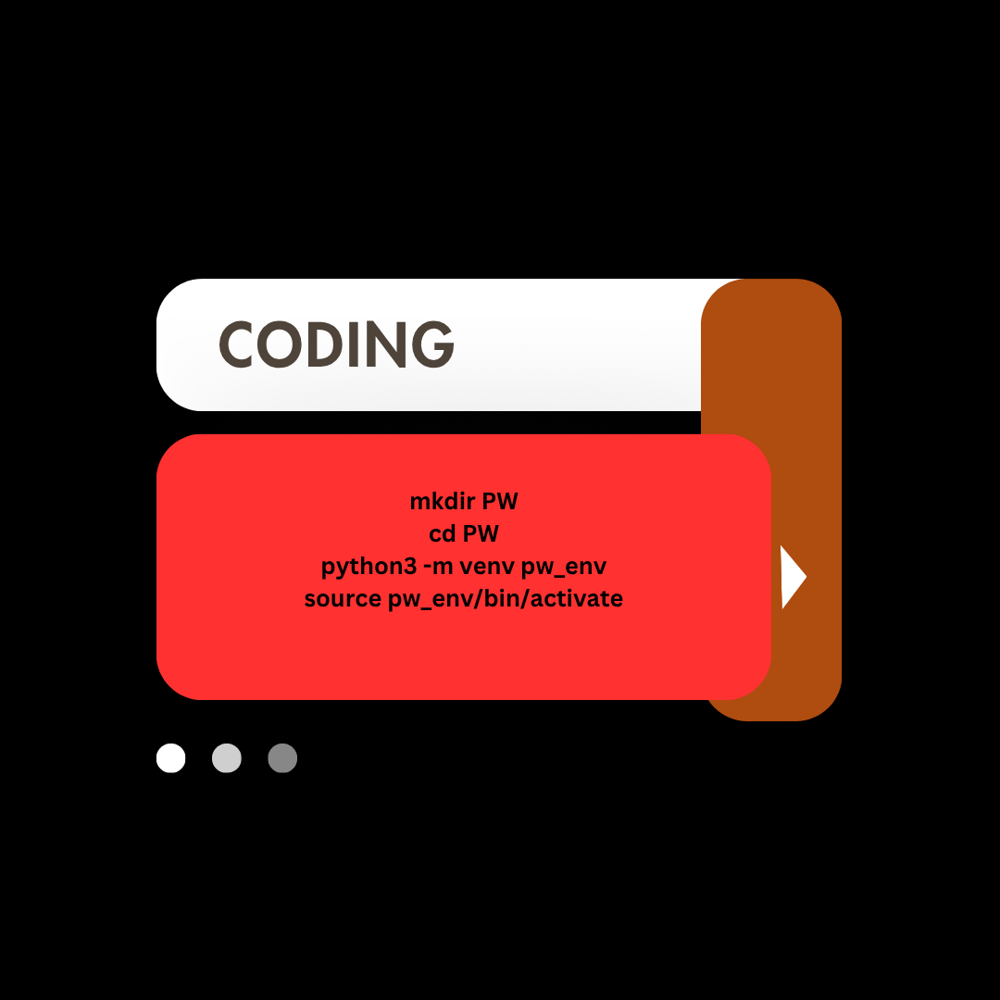

# My Flask Personal Website

This is my personal website built using Flask on Linux.

What I Have Done :

    Created a Flask app to serve my website.
    Made an HTML file for the webpage.
    Set up a virtual environment called pw_env. #personalwebsite environment
    Learned how to run the website locally.

How to Run the Website.

Prerequisites:

    Python 3 and Pip(Pythons package installer) installed on your Linux system.
    
# "Using the terminal" Verify and set up,Check if Python 3 and pip are installed:  if not try: .

    Flask installed in your virtual environment (pw_env).

# "Using the terminal" Create a virtual environment in your project to manage dependencies separately,(NB what i did is based on the guides,you can customize where ever you prefer),the virtual environment should be activated , then install Flask,while the virtual environment is activated . Verify that Flask was installed successfully .

............................Procedures..........................................
# Run the website

    -Open your terminal.
    -Navigate to your project folder:
    #I used#
            cd ~/PW

    -Activate your virtual environment:
                
            source pw_env/bin/activate

      
    -Set environment variables:

            export FLASK_APP=website.py
            export FLASK_ENV=development

Start the Flask server:

            flask run

    -Open your web browser and go to:

                    http://127.0.0.1:5000
Notes:

    -Refresh the page to see updates after editing files.

    -You can automate starting the server and opening the page with a script for convenience.
    
